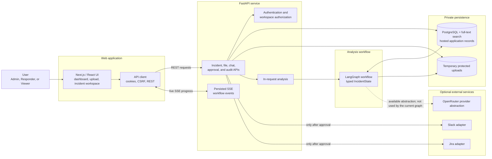
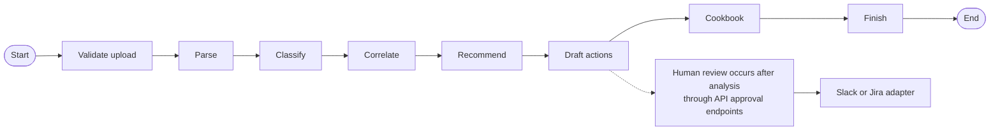

# DevOps Incident Analysis Suite — Architecture

## What the application does

The DevOps Incident Analysis Suite helps an incident responder turn raw operational log files into an understandable, evidence-backed explanation of what may be wrong and a safe response plan that a person reviews before anything is sent outside the application.

Its main technical capabilities are a LangGraph-orchestrated sequence of specialist analysis stages, structured multi-format log parsing, secret masking, rule-based issue classification and trace correlation, evidence-linked findings, incident-scoped search and chat, resumable progress streaming, approval-gated Slack/Jira delivery, and durable audit history.

> **Plain-language context:** an *incident* is a period when a software service is broken or behaving unexpectedly. A *log* is a text record written by software as it runs. This application organizes those records so a responder can identify likely causes and decide what to do next.

## Primary objective

The objective is to reduce the time between receiving a large collection of logs and reaching a reviewable incident response, while preserving the original evidence and keeping every real-world action under human control. The application recommends actions; it never runs infrastructure-changing commands.

## Key features for users

- **Secure account and workspace access:** users sign up or log in, and incident data is restricted to their workspace. The first registered user is an Admin; later users are Responders.
- **Guided incident creation:** a responder records a title and optional service, environment, deployment, and impact context.
- **Multi-format log upload:** the app accepts `.log`, `.txt`, `.json`, `.jsonl`, and `.csv` files, up to 5 files and 3 MB per incident for hosted compatibility.
- **Live analysis progress:** the incident screen shows each analysis phase and a persisted activity trace while work runs.
- **Evidence-backed findings:** likely problems are ranked by severity and confidence and linked to the exact source file and line numbers that support them.
- **Incident-scoped questions:** users can ask about the incident and receive answers based on its findings and searchable evidence, rather than a general internet search.
- **Response cookbook:** the system produces an exportable Markdown checklist covering triage, containment, diagnosis, remediation, validation, rollback, monitoring, and follow-up.
- **Human-controlled integrations:** Slack messages are drafted for findings, and critical findings also produce Jira drafts. A Responder or Admin must approve the exact payload before delivery. Mock Slack and Jira adapters are used by default.
- **History and auditability:** users can revisit incidents, filter history, inspect workflow events, and retain approvals and delivery records.

## End-to-end user workflow

1. **Sign in.** The browser authenticates with the API and receives a secure session cookie plus a CSRF token used to protect data-changing requests.
2. **Describe the incident.** The user enters the affected service and any useful context, such as the environment or a recent deployment.
3. **Upload logs.** The API checks file count, total size, extension, MIME type, binary content, and UTF-8 compatibility. Files are stored temporarily under generated names outside the web application’s public files.
4. **Start analysis.** The API creates a run and completes the LangGraph workflow within the same HTTP request so it is compatible with hosted functions.
5. **Follow progress.** The LangGraph workflow emits durable events for every stage. The web app reads them through Server-Sent Events (SSE) and also refreshes the incident record while analysis is active.
6. **Review results.** The user sees probable root causes, severity, confidence, and exact evidence excerpts. These are hypotheses for a responder to validate, not claims that the system has changed anything.
7. **Explore and respond.** The user can ask incident-specific questions, read or export the response cookbook, and inspect proposed Slack or Jira payloads.
8. **Approve or reject external actions.** The API verifies that the reviewed payload hash still matches the saved draft. Approval delivers through the selected adapter; rejection records the decision without delivery.
9. **Return later.** Incidents, findings, chat messages, workflow events, approvals, deliveries, and audit records remain available in history.

## System architecture



The browser never connects directly to the database, temporary uploaded files, provider credentials, Slack, or Jira. The FastAPI service is the policy boundary: it authenticates the user, checks workspace ownership and roles, validates uploads, performs analysis, and controls all external delivery.

## Components at each workflow stage

| Stage | User experience | Components involved | Data passed to the next stage |
|---|---|---|---|
| Account access | Sign up, log in, or log out | React auth form → FastAPI auth routes → `auth.py` → PostgreSQL users/sessions | Authenticated user, role, workspace, session, and CSRF token |
| Incident setup | Enter incident context | New-incident page → shared API client → incident API → PostgreSQL | Incident ID and optional service/environment/deployment context |
| File ingestion | Select or drop log files | Upload page → multipart API → validation in `main.py` → protected upload directory and `files` table | Validated file manifest containing durable IDs and storage references |
| Run execution | Start analysis | Combined upload/analysis API → LangGraph in the same request | Run ID, incident context, and file manifest |
| Normalize | See parsing progress | LangGraph parse stage → `parsing.py` → `log_events` and FTS5 tables | Normalized event references, redacted messages, and warnings |
| Analyze | See likely issues and evidence | Classify, correlate, and recommend stages → findings/evidence/recommendations tables | Structured findings, evidence IDs, correlation groups, and response steps |
| Prepare response | See proposed external messages and cookbook | Draft-action and cookbook stages → action and cookbook tables | Immutable payloads with hashes plus an exportable Markdown guide |
| Live presentation | Watch the rail and execution trace | Workflow event table → SSE endpoint → incident React page | Ordered, reconnectable status events and refreshed incident details |
| Human decision | Approve or reject a payload | Incident page → approval API → role and payload-hash checks → delivery adapter | Approval record and either a delivery reference or rejection |
| Investigation | Ask questions or revisit history | Incident chat/history pages → FTS5 and incident tables | Saved conversation with evidence citations; persistent incident record |

## How the LangGraph flow works

LangGraph supplies the workflow structure. A run begins with a typed `IncidentState`, a compact shared record containing IDs, incident context, file metadata, stage status, references to database records, findings, recommendations, draft actions, warnings, and errors. Full log files are not copied into graph state; nodes use IDs to read and write durable data in PostgreSQL (or SQLite during local development).

The implemented graph is linear:



The phases run as specialized functions inside one LangGraph workflow rather than as separate autonomous processes. Recommend and Cookbook use the configured OpenRouter reasoning model with strict structured-output contracts. Both retain their deterministic implementations as automatic fallbacks when provider configuration, requests, or output validation fail.

### Specialist stages and responsibilities

1. **Validate Upload (`validate_upload`)** confirms that at least one previously validated file is present. Detailed safety checks have already happened at the upload API boundary.
2. **Parse (`parse_logs`)** reads each stored file through the appropriate parser, combines multiline text records, normalizes timestamps to UTC, maps log levels to a common severity scale, extracts service/environment/correlation IDs, masks likely secrets, hashes the cleaned message, and writes searchable events. A malformed file can be marked partial while other usable files continue.
3. **Classify (`classify_events`)** selects actionable-looking events and applies ordered pattern rules for security, databases, networking, capacity, deployment regressions, dependencies, performance, authentication, infrastructure, and general application errors. It groups matches by issue type and service, assigns severity/confidence, and saves a finding with exact-line evidence.
4. **Correlate (`correlate`)** groups events that share a trace, request, or correlation ID and records their counts and time range. This helps show that records from different moments may belong to the same request or failure chain.
5. **Recommend (`remediate_with_ai`)** sends bounded, already-redacted finding evidence to OpenRouter and requires one structured plan per finding across triage, containment, diagnosis, remediation, validation, and rollback. It validates finding IDs and every required phase before persistence, then falls back to `remediate` if AI generation is unavailable or invalid.
6. **Draft Actions (`draft_actions`)** selects the highest-priority finding and creates an immutable Slack preview. A critical finding also creates a Jira preview. Each payload receives a content hash and idempotency key so a changed or repeated request cannot silently deliver different or duplicate content.
7. **Cookbook (`cookbook_with_ai`)** asks OpenRouter to synthesize the incident context, findings, and recommendations into an operator-focused Markdown guide. Required headings and checklist syntax are validated before the guide is stored in the database; `cookbook` remains the fallback.
8. **Finish (`finish`)** updates the run and incident. A run with action drafts becomes `awaiting_approval`; otherwise it completes. The incident becomes `active` when findings exist or `monitoring` when none were found.

### Human review is outside the graph

“Review” appears as a visible workflow phase, but it is not a LangGraph node. The draft stage emits a waiting event, the graph continues to create the cookbook and finish, and the user later approves or rejects each draft through FastAPI endpoints. This separation is intentional: analysis code may propose an external action, but only the authenticated API approval path can release it.

Cancellation is checked before parsing and classification. Every graph node emits persisted workflow events. If a node raises an exception, the run is marked failed and a safe error event is stored.

## Data and storage model

PostgreSQL is the hosted system of record (with SQLite retained as a local-development fallback) for:

- users, sessions, roles, and workspaces;
- incidents, files, analysis runs, and workflow events;
- normalized log events and their FTS5 full-text index;
- findings, exact evidence excerpts, and recommendations;
- external-action drafts, approvals, and delivery results;
- response cookbooks, incident conversations, and messages;
- integration metadata and audit events.

Uploaded files live only in a protected temporary directory while their request is being analysed, then are deleted. Cookbooks are stored in the database rather than as generated files. PostgreSQL indexes support incident history, event timestamps, severity filtering, pending actions, audit queries, and full-text search.

The chat feature performs incident-limited FTS5 keyword retrieval and falls back to evidence from the highest-confidence finding. Its current answer is deterministic and summarizes the top finding; it does not call the `LLMProvider` abstraction.

## API and frontend connection

The frontend’s shared `api()` helper prefixes `/api/v1`, includes browser credentials, adds JSON headers when needed, and copies the CSRF cookie into a request header for state-changing operations. FastAPI exposes endpoints for authentication, incidents, uploads, runs and cancellation, findings and evidence, incident chat, action decisions, cookbooks, integration tests, and audit history.

Analysis updates use SSE. Each event is first saved in `workflow_events` with an increasing ID. The incident page supplies the last received ID when reconnecting, so the API can resume from the next event rather than relying only on transient in-memory messages. The page also periodically refreshes incident details until the run reaches a terminal or approval-waiting state.

## Safety and trust boundaries

- Passwords are hashed with Argon2id; raw session identifiers are hashed before database storage.
- The session cookie is HttpOnly and SameSite, and mutations require double-submit CSRF validation.
- Every incident-scoped query checks the authenticated user’s workspace.
- Viewer, Responder, and Admin roles exist; mutation and approval operations require appropriate access.
- Upload validation restricts file type, MIME type, count, total size, binary content, and text encoding.
- Stored filenames are generated; user-supplied names are retained only as display metadata.
- Likely passwords, tokens, API keys, and common secret formats are masked before normalized messages become evidence.
- Findings cite exact file lines and store content hashes to preserve provenance.
- Slack/Jira approval binds to the exact saved payload hash, and delivery is unique per action.
- Credentials remain server-side and do not enter browser state, graph state, or uploaded evidence.
- No graph stage or chat path has a tool for executing operational commands.
- Account, incident, analysis, approval, and integration activities are written to the audit log.

## Technology stack

| Layer | Technology | Purpose |
|---|---|---|
| Web UI | TypeScript, React 19, Next.js App Router | Pages, navigation, forms, live incident workspace, and client interactions |
| Styling and UI | Tailwind CSS tooling, project CSS, Shadcn/Base UI components, Lucide icons | Responsive presentation and reusable interface controls |
| Frontend build/runtime | Next.js and Node.js | Local development and Vercel frontend runtime |
| API | Python 3.13, FastAPI, Uvicorn, Pydantic | HTTP endpoints, validation, authentication, policy, and serialization |
| Workflow | LangGraph | Ordered specialist stages and typed request-scoped state |
| Database/search | PostgreSQL with full-text search; SQLite fallback locally | Durable records, relationships, audit history, and keyword retrieval |
| File storage | Protected temporary filesystem | Raw uploads only while the current analysis request runs |
| Security | Argon2, secure cookies, CSRF tokens, SHA-256 hashes | Password, session, evidence, file, and payload protection |
| HTTP integrations | HTTPX, provider/adapter interfaces | Optional OpenRouter access and mock or official Slack/Jira delivery |
| Local orchestration | Docker Compose | Runs the web and API services with a local data volume |
| Tests | Pytest and FastAPI TestClient | Parser checks and the human-approved incident flow |

## Code structure

Generated build output, Python caches, installed dependencies, and runtime data are omitted below so the map focuses on source files.

```text
.
├── ARCHITECTURE.md                 # This high-level system guide
├── README.md                       # Short setup and safety overview
├── docker-compose.yml              # Web, API, and local data volume
├── data/                            # Local fallback database and temporary uploads
└── apps/
    ├── api/
    │   ├── Dockerfile              # Python API container image
    │   ├── requirements.txt        # Pinned backend dependencies
    │   ├── requirements-dev.txt    # Backend dependencies plus test tools
    │   ├── app/
    │   │   ├── main.py             # FastAPI app, routes, upload policy, SSE, chat, approvals
    │   │   ├── orchestrator.py     # LangGraph state flow and specialist stage logic
    │   │   ├── parsing.py          # File parsers, normalization, masking, classification rules
    │   │   ├── database.py         # PostgreSQL/SQLite schemas and transaction helper
    │   │   ├── schemas.py          # API request models, roles, and typed IncidentState
    │   │   ├── auth.py             # Passwords, sessions, CSRF, workspace user, role checks
    │   │   ├── providers.py        # LLM abstraction plus Slack/Jira delivery adapters
    │   │   └── config.py           # Environment-driven settings and storage paths
    │   └── tests/
    │       ├── test_api.py         # End-to-end create/upload/analyze/approve test
    │       └── test_parsing.py     # Secret masking, normalization, and classification tests
    └── web/
        ├── Dockerfile              # Local Node frontend container
        ├── package.json            # Frontend packages and dev/build scripts
        ├── next.config.ts          # Next.js settings and same-origin API proxy
        ├── vercel.json             # Vercel frontend framework configuration
        ├── app/
        │   ├── layout.tsx          # Shared HTML shell, fonts, and global styles
        │   ├── page.tsx            # Public product overview
        │   ├── login/, signup/     # Authentication screens
        │   ├── app/                # Signed-in incident dashboard
        │   ├── history/            # Searchable/filterable incident history
        │   ├── incidents/new/      # Incident context and file-upload workflow
        │   ├── incidents/[id]/     # Live findings, chat, cookbook, trace, approvals
        │   ├── settings/           # Slack/Jira integration status and tests
        │   └── architecture/       # In-product architecture summary page
        ├── components/
        │   ├── app-shell.tsx       # Signed-in navigation, header, logout, theme control
        │   ├── auth-form.tsx       # Shared login/signup behavior
        │   └── ui/                 # Reusable interface primitives
        └── lib/
            ├── api.ts              # Credentialed REST/CSRF client used by pages
            └── utils.ts            # Shared frontend utility functions
```

The additional `analysis`, `chat`, `cookbook`, and `findings` route files under `incidents/[id]/` simply re-export the same incident workspace; the working experience is consolidated in `incidents/[id]/page.tsx` and separated visually with tabs.

## Runtime modes and production path

For a lightweight local run, the API can use SQLite and deterministic mock integrations. Hosted deployments set `DIAS_DATABASE_URL` to Neon PostgreSQL. Both the combined endpoint and the legacy run endpoint finish analysis within their HTTP request; no Redis service, separate worker, or checkpoint database is required. Raw logs are temporary, while normalized events, evidence, findings, cookbooks, account data, and sessions remain in PostgreSQL.

The request-scoped workflow is intentionally small enough for a simple hosted deployment. The 3 MB aggregate upload limit leaves room for multipart request overhead. Semantic/vector retrieval is not currently implemented and should be added only if evaluation shows it improves evidence retrieval.

Official Slack and Jira adapters exist, but the default and safest demonstration configuration is mock mode. OpenRouter powers only recommendation and cookbook generation with bounded, redacted context. Its output remains advisory, and the existing structured-output validation and human approval boundary still govern every external action.
